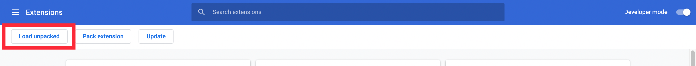

# extension-avalanche

Avalanche Wallet Browser Extension.

## Prerequesites

- [Install Node](https://nodejs.org/en/download/) (version 16 or upper)
- [Install Yarn](https://classic.yarnpkg.com/lang/en/docs/install)

### Login to your NPM profile via the CLI

This is so you can install `@avalabs` packages from the NPM registry:

```sh
npx npm-cli-login -u YOUR_NPM_USERNAME -p YOUR_NPM_PASSWORD -e YOUR_NPM_EMAIL
```

You can also [set up an access token](https://docs.npmjs.com/creating-and-viewing-access-tokens) if you prefer.

## Development

`yarn dev` watches for changes.

## Build

`yarn build` will run everything through webpack and create a `/dist` directory.

## Development

### Chrome or Brave Development

1. In Chrome or Brave, go to `chrome://extensions/`.
2. At the top right make sure you have `Developer mode` turned on:


3. After `Developer mode` is turned on, at the top left should be `Load unpacked`:



4. Click `Load unpacked` and go to the extension folder.
5. Select the `dist` folder and press `Select`.

### Firefox Development

1. Go to `about:debugging#/runtime/this-firefox`.
2. Click `Load Temporary Add-on`.
3. Point to either the `dist/manifest.json` or the zip file from running the build command.

## Release

All you need to do is to merge your release branch onto `main`.
