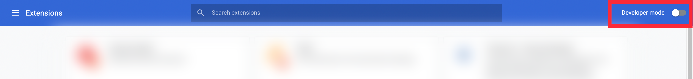

<h1 align="center">Core Extension</h1>

<p align="center">
  
  <br>
  <i>
    Core is a non-custodial browser extension engineered for users to <br>
    seamlessly and securely use Web3 powered by Avalanche.
  </i>
  <br>
</p>

<p align="center">
  <a href="https://chrome.google.com/webstore/detail/core-crypto-nft-wallet-ex/agoakfejjabomempkjlepdflaleeobhb">
    
  </a>&nbsp;
  <a href="https://chrome.google.com/webstore/detail/core-crypto-nft-wallet-ex/agoakfejjabomempkjlepdflaleeobhb">
    
  </a>
</p>

<hr>

## Development Setup

### Prerequisites

- Install [Node.js] and [Yarn] <br/>The project uses [Volta] to manage Node.js and Yarn versions, however, it's not mandatory to use Volta, you can always just install the correct version or use another tool like `nvm`.

- Get added to `@avalabs` on [npmjs.com].<br/>
  The project uses multiple private SDKs and utility packages from NPM.<br/>
  Make sure you have 2FA enabled.

### Environment variables

- Copy `.env.example` file and rename it as `.env`
  - Populate environment variables with your own values

### Setting Up a Project

1. Install dependencies

```
yarn
```

2. Create environment variable file `.env.dev` based on the `.env.example`.

3. Run the project

```
yarn dev
```

4. Load the extension in your Chrome

### Chrome Development

1. In Chrome, go to `chrome://extensions/`.
2. At the top right make sure you have `Developer mode` turned on:



3. After `Developer mode` is turned on, at the top left should be `Load unpacked`:


4. Click `Load unpacked` and go to the extension folder.
5. Select the `dist` folder and press `Select`.

### Update api clients

Please refer to the **[DOC](/packages/service-worker/src/api-clients/README.md)**

## Release

### Versioning

The project uses semantic versioning to determine the next version number.
Use the [conventional commmit] format for increasing the version number correctly.

- `feat`: a commit of the type feat introduces a new feature to the codebase (this correlates with MINOR in Semantic Versioning).
- Having the `BREAKING CHANGE` or `BREAKING CHANGES` string in the commit message bumps the major version number
- Other scopes like `fix`, `build`, `chore`, `ci`, `docs`, `style`, `refactor`, `perf`, `test` or having no scope, increment the PATCH section of the version number

### Alpha releases

Alpha releases are automatically created after each merge into `main`.<br/>
Bundles can be found in the "Releases" section of the repo.

### Production releases

Production releases are created by the `Create prod release` Github action.
The action needs to be triggered manually, and can be triggered on any branch making it easier to create hotfix releases.

- Make sure the branch you are creating the release on is clean and good to go
- Go to Actions and select the "Create prod release" action
- Click "Run workflow" and select the target branch
- After the workflow run is complete, the new release is automatically pushed to the Releases page of the repo and the commit gets tagged
- After green light from QA, upload the build to the Chrome

### Create a production release locally

Only use this for testing. Production versions for Chrome Store submission should ALWAYS be created through CI.

1. Create a `.env.production` file based on the `.env.example` with the production values.
2. Run `yarn`
3. Run `yarn build`. This will create the build into the `/dist` folder just like the regular development flow does.
4. Run `yarn zip`. It packages up the `/dist` folder into a `.zip` file suitable for Chrome Store uploads. The new file is placed into the `/builds` folder.

[node.js]: https://nodejs.org/dist/latest-v16.x/
[yarn]: https://classic.yarnpkg.com/lang/en/docs/install
[volta]: https://volta.sh/
[npmjs.com]: https://www.npmjs.com/
[conventional commmit]: https://www.conventionalcommits.org/en/v1.0.0/
