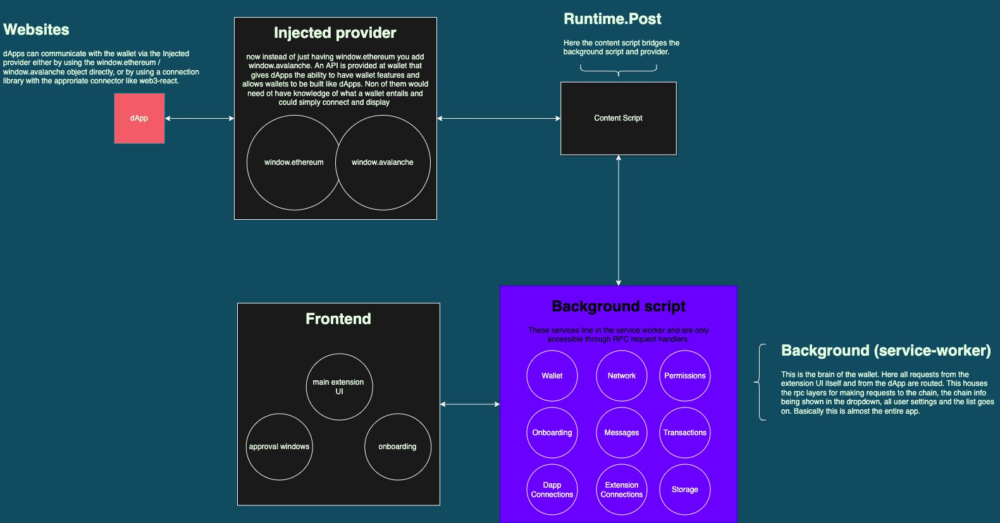

# Core Wallet architecture

## Overview

The Core wallet is a browser extension built for Chromium browsers using the Manifest V3 format.
The app has 4 separate pieces which run in isolated environments and communicate with serialized JSON messages:

- Background script
- Frontend script
- Content script
- Injected provider

### Background script

The Background script is responsible for managing network communication, transaction signing, storage, and all other tasks required for processing requests from dApps and the frontend.

### Frontend

The Frontend script is responsible for displaying onboarding screens, the main user interface, and approval windows. It does not store any data in storage, except for some parameters in the URL and navigation history. The Frontend script receives all data and events necessary for the proper functioning of the UI from the Background script.

### Content script

The Content script acts as a bridge between the Background script and the Injected provider within websites. It receives messages from the Background script and forwards them to the Injected provider, and vice versa.

### Injected provider

The Injected provider is an [EIP-1193](https://eips.ethereum.org/EIPS/eip-1193) compliant wallet provider that is injected into every tab to provide Web3 capabilities for websites. This enables the website to access a user's wallet and perform blockchain transactions without requiring the user to leave the website.

## Architecture diagram

