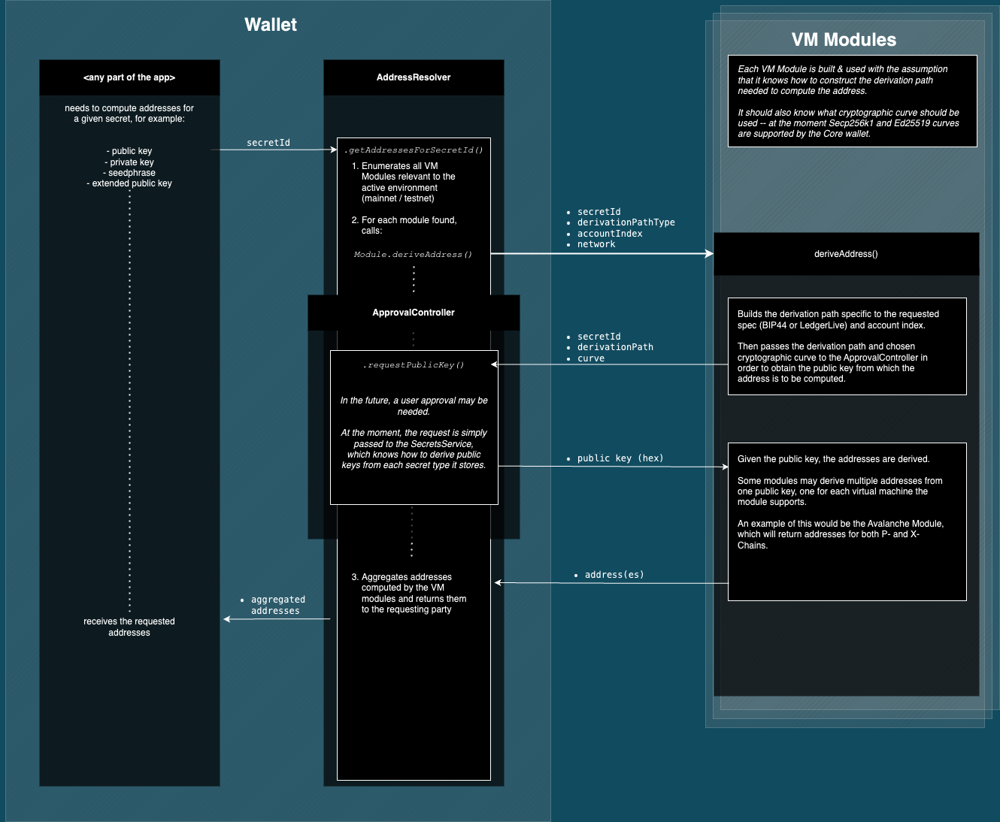
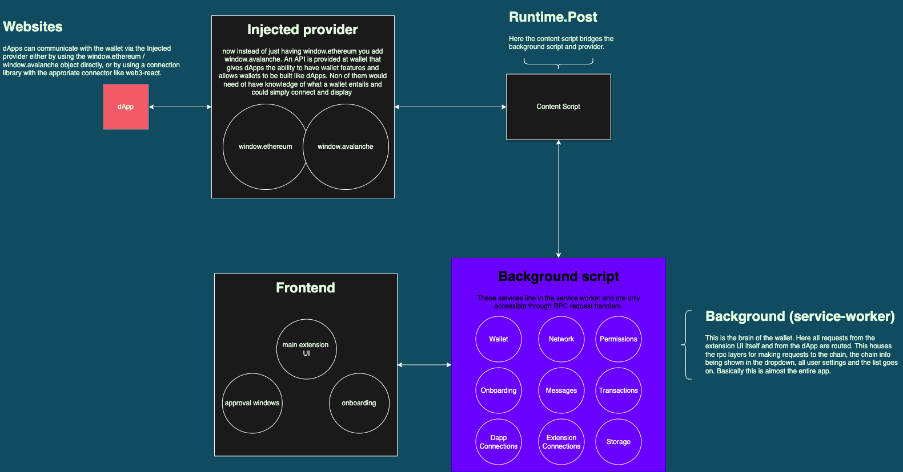

# Core Wallet architecture

## Overview

The Core wallet is a browser extension built for Chromium browsers using the Manifest V3 format.
The app has 4 separate pieces which run in isolated environments and communicate with serialized JSON messages:

- Service worker
- Frontend script
- Content script
- Injected provider

### Service worker

The service worker (also referred to as the background script) is responsible for managing network communication, transaction signing, storage, and all other tasks required for processing requests from dApps and the frontend.

### Frontend

The Frontend script is responsible for displaying onboarding screens, the main user interface, and approval windows. It does not store any data in storage, except for some parameters in the URL and navigation history. The Frontend script receives all data and events necessary for the proper functioning of the UI from the service worker.

### Content script

The Content script acts as a bridge between the service worker and the Injected provider within websites. It receives messages from the service worker and forwards them to the Injected provider, and vice versa.

### Injected provider

The Injected provider is an [EIP-1193](https://eips.ethereum.org/EIPS/eip-1193) compliant wallet provider that is injected into every tab to provide Web3 capabilities for websites. This enables the website to access a user's wallet and perform blockchain transactions without requiring the user to leave the website.

## Repository layout

The repository is a Yarn workspaces monorepo. Each of the four pieces above lives in its own package:

| Workspace                  | Contents                                                                                     |
| -------------------------- | -------------------------------------------------------------------------------------------- |
| `apps/next`                | The extension frontend (React app, all entry points)                                         |
| `packages/service-worker`  | Services, handlers, and the VM module layer running in the service worker                    |
| `packages/content-script`  | The bridge between the service worker and the injected provider                              |
| `packages/inpage`          | The EIP-1193 / EIP-6963 provider injected into web pages                                     |
| `packages/offscreen`       | Offscreen document, used where DOM APIs are unavailable in the service worker                |
| `packages/ui`              | Shared React components, hooks, and providers                                                |
| `packages/messaging`       | Cross-context messaging and JSON serialization                                               |
| `packages/common`          | Shared utilities, constants, and helpers                                                     |
| `packages/types`           | Shared TypeScript type definitions                                                           |
| `packages/lavamoat-rspack` | Build-time supply-chain sandboxing (see its [README](../packages/lavamoat-rspack/README.md)) |

## VM modules and address derivation

Chain-specific logic is not implemented in the extension itself. It lives in separate VM modules (`@avalabs/evm-module`, `@avalabs/bitcoin-module`, and friends), which the service worker loads through `ModuleManager` (`packages/service-worker/src/vmModules/ModuleManager.ts`).

Each module knows how to build the derivation path and pick the cryptographic curve (Secp256k1 or Ed25519) for the chains it supports. Address derivation is therefore a collaboration between the wallet and the modules: `AddressResolver` (`packages/service-worker/src/services/secrets/AddressResolver.ts`) enumerates the modules relevant to the active environment, asks each one to derive addresses for a given secret, and aggregates the results. Public keys are obtained through the `ApprovalController` (`packages/service-worker/src/vmModules/ApprovalController.ts`), which delegates to the `SecretsService`.

One public key can yield multiple addresses — the Avalanche module, for example, returns addresses for both the P- and X-Chains.

To develop against a locally modified VM module, see [Linking local VM modules with yalc](YALC_VM_MODULES.md).

## Architecture diagram

