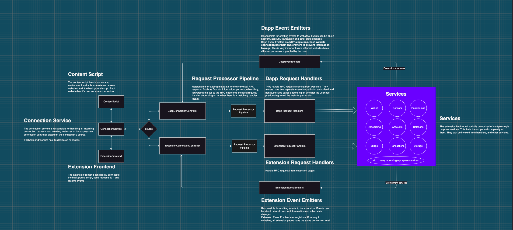

# Background script architecture

## Overview

The Background script is responsible for network communication, transaction signing, storage, and all tasks required for processing requests from dApps and the extension frontend.

It's a service worker utilizing the Manifest V3 extension format.

## Limitations of the background script.

Since the background script is a service worker the following limitations affect its environment:

- No `XMLHttpRequest` support. Use `fetch` instead. If a lib tries to use `XMLHttpRequest`, use another lib or patch it.
- No `window` object or DOM methods available. Chrome introduced [offscreen document](https://developer.chrome.com/docs/extensions/reference/offscreen/) support in version 109. If you absolutely have to use DOM APIs, you need to use offscreen documents.
- The service worker can and will restart randomly. Prior to Chrome 110, the service worker had a 5-minute hard limit for execution time. In 110 Chrome has changed this limitation allowing background scripts to run longer, however, there still are a 5-minute idle timeout and a 30-second long task execution limit. Also per the Chrome team [`In a future release, we may change how specific events are processed to prevent keeping service workers alive indefinitely`](https://developer.chrome.com/blog/longer-esw-lifetimes/)
- A lot stricter [CSP](https://developer.chrome.com/docs/extensions/mv3/sandboxingEval/)

**You can read more about the manifest V3 plaform here:** [https://developer.chrome.com/docs/extensions/mv3/intro/](https://developer.chrome.com/docs/extensions/mv3/intro/)

## DOs and DON'Ts

- **DO NOT** make a Dapp Event Emitter singleton. It would result in event multicasting and data leakage. Websites would be notified even if they were not previously approved by the user and would receive updates about interactions on other websites.
- **DO NOT** add complex logic to services. Services should be single purpose, handlers should combine the functionality of services.
- **DO NOT** expose the private keys or secrets outside of the respective service.
- **DO NOT** store data in memory for a long time. Be prepared so that the background service worker can be restarted at any time. Rule of thumb, if you need to wait for user interaction, rather save the data in storage (encrypted).
- **DO NOT** store any data unencrypted or directly through chrome's APIs unless absolutely necessary. Use the `StorageService` for this purpose.
- **DO** clean up internal state and subscriptions in services when the wallet gets locked.

## Architecture diagram

