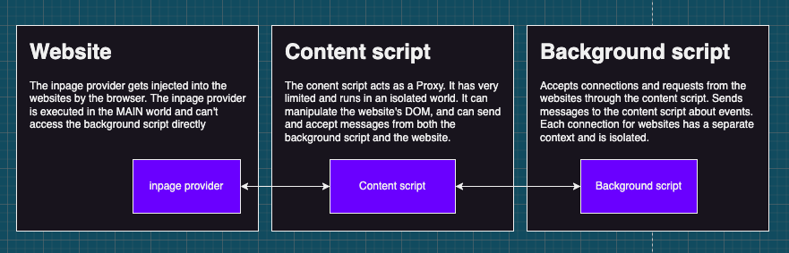
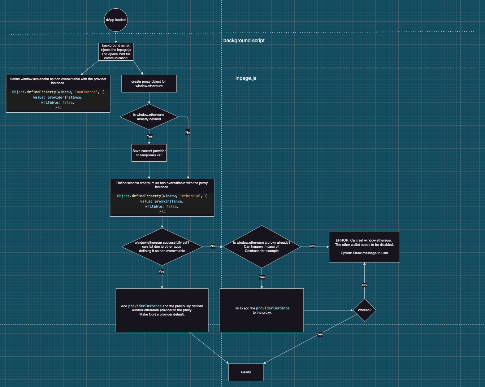

# DApp connections

## Overview

As most EVM-compatible browser extension wallets, Core implements the [EIP-1193](https://eips.ethereum.org/EIPS/eip-1193) Ethereum provider standard as well.
Core injects an inpage provider into each tab the user opens within their browser, and opens a communication channel to the background script, through the content script.

## How does it work

The inpage provider is injected by the background script and is executed in the MAIN world. This means that the inpage provider has full access to the website's context, but can't connect directly to the background script.

To bridge the gap between the inpage provider and the background script, the content script gets injected by the browser (based on the manifest declaration). The content script runs in the ISOLATED world. This means that it has access to the website's DOM, and can communicate with the background script and the frontend script. With this capability, it acts as a proxy for RPC requests and events.

You can read more about the content script here: https://developer.chrome.com/docs/extensions/mv3/content_scripts/

## Playing nice with other wallets

Since each EVM-compatible wallet needs to implement the same interface, defined in [EIP-1193](https://eips.ethereum.org/EIPS/eip-1193), the initialization becomes a race for grabbing and owning the `window.ethereum` object. Various wallets implement different strategies to deal with other wallets.

- MetaMask: Does nothing, it's the bigger, and everyone needs to play nicely with them.
- Rabby: Plays nicely with MetaMask, but not with any other wallets. If there is another wallet already injected, it tries to overwrite its property by property, which makes it hard to capture Rabby's provider as a whole and provide selection options
- Coinbase wallet: Uses a Proxy object and collects other wallet's providers into a `_providers` array. This makes app-specific connectors able to select the exact wallet they want. Very similar to Core's implementation.

When Core's provider gets injected, it attempts to lock down both the `window.ethereum` and `window.avalanche` properties. It creates a Proxy object and starts to listen to overwrite attempts. If another wallet attempts to overwrite Core's provider, it gets stored in the `providers` array. Next time when the website attempts to connect to `window.ethereum`, Core prompts the user to select the wallet they want to use. The selected provider will be set as default for the current session for all communications.

In order to try and elimate the "race" to own the `window.ethereum` object, the [EIP-5749](https://eips.ethereum.org/EIPS/eip-5749) replaces `window.ethereum` with `window.evmproviders`. Each wallet will have a `{[index: string]: Provider}` in the `window.evemproviders` object. As for now this is NOT a breaking change and does not required replacing the `window.ethereum` with `window.evmproviders` object but rather has both and in the future replacing `window.ethereum` with `window.evmproviders` and such causing a breaking change.

## Initialization

## DOs and DON'Ts

- **DO NOT** use libraries in the injected provider that are altering global objects. They can break websites. For example, using lodash in the injected provider will break JIRA.
- **DO** keep the injected provider as light as possible.
- **DO** maintain isolation between connections.
