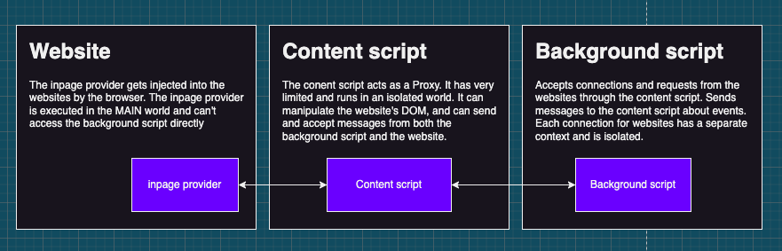
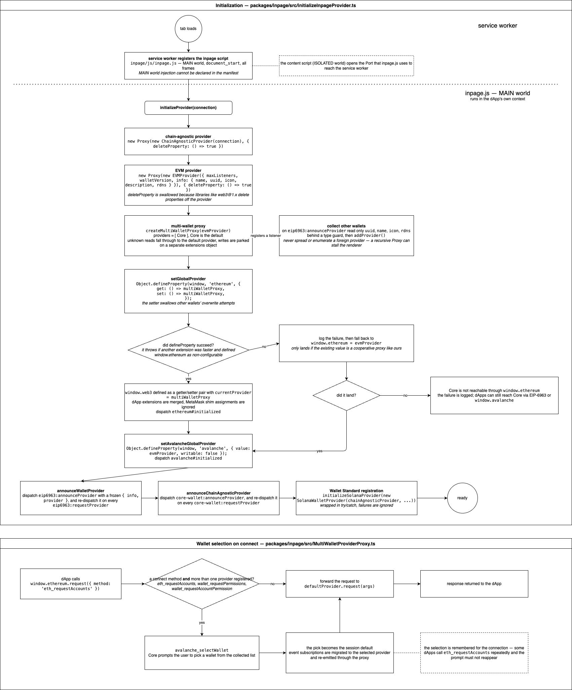

# DApp connections

## Overview

As most EVM-compatible browser extension wallets, Core implements the [EIP-1193](https://eips.ethereum.org/EIPS/eip-1193) Ethereum provider standard as well.
Core injects an inpage provider into each tab the user opens within their browser, and opens a communication channel to the service worker, through the content script.

## How does it work

The inpage provider is injected by the service worker and is executed in the MAIN world. This means that the inpage provider has full access to the website's context, but can't connect directly to the service worker.

To bridge the gap between the inpage provider and the service worker, the content script gets injected by the browser (based on the manifest declaration). The content script runs in the ISOLATED world. This means that it has access to the website's DOM, and can communicate with the service worker and the frontend script. With this capability, it acts as a proxy for RPC requests and events.

You can read more about the content script here: https://developer.chrome.com/docs/extensions/mv3/content_scripts/

## What gets injected

`initializeProvider` (`packages/inpage/src/initializeInpageProvider.ts`) sets up more than the EVM provider:

- `window.ethereum` — the EIP-1193 EVM provider, wrapped in the multi-wallet proxy described below.
- `window.avalanche` — the same EVM provider, defined as non-writable so that it always resolves to Core.
- `window.web3.currentProvider` — a legacy shim pointing at the same proxy.
- A chain-agnostic provider, announced separately for non-EVM chains.
- A Solana wallet provider registered through the Wallet Standard, built on top of the chain-agnostic provider.

## Provider discovery

### EIP-6963

Core implements [EIP-6963](https://eips.ethereum.org/EIPS/eip-6963), which is how modern dApps discover wallets without competing for `window.ethereum`. On initialization Core dispatches an `eip6963:announceProvider` event carrying its provider info (`uuid`, `name`, `icon`, `rdns`), and re-announces whenever a dApp dispatches `eip6963:requestProvider`.

Core also listens for other wallets' `eip6963:announceProvider` events and registers them with its multi-wallet proxy. When reading a foreign wallet's `info`, only a fixed set of fields is read, one property at a time — spreading or enumerating a foreign object invokes `ownKeys` plus a `get` per claimed key, which has been observed to stall the renderer when another wallet's provider is itself a recursive Proxy.

A parallel `core-wallet:announceProvider` event announces the chain-agnostic provider for dApps that need non-EVM access.

### The window.ethereum race

EIP-6963 has not made `window.ethereum` obsolete — plenty of dApps still read it directly, so the initialization is still a race for grabbing and owning that object. Various wallets implement different strategies to deal with other wallets.

- MetaMask: Does nothing, it's the bigger, and everyone needs to play nicely with them.
- Rabby: Plays nicely with MetaMask, but not with any other wallets. If there is another wallet already injected, it tries to overwrite its property by property, which makes it hard to capture Rabby's provider as a whole and provide selection options
- Coinbase wallet: Uses a Proxy object and collects other wallet's providers into a `_providers` array. This makes app-specific connectors able to select the exact wallet they want. Very similar to Core's implementation.

When Core's provider gets injected, it attempts to lock down both the `window.ethereum` and `window.avalanche` properties. It defines `window.ethereum` as a getter returning a Proxy and swallows overwrite attempts, storing the other wallet's provider in the `providers` array instead. Next time when the website attempts to connect to `window.ethereum`, Core prompts the user to select the wallet they want to use. The selected provider will be set as default for the current session for all communications.

If another extension was faster and defined `window.ethereum` as non-writable, Core logs the failure and falls back to assigning its provider directly, in case the existing value is a cooperative proxy like ours.

## Initialization

The lower half of the diagram covers the wallet selection that happens on the first connect request, described above. The source is [`diagrams/window-ethereum-proxy.drawio`](diagrams/window-ethereum-proxy.drawio); re-export it to `images/inpage-initialization-process.png` when you change it.

## DOs and DON'Ts

- **DO NOT** use libraries in the injected provider that are altering global objects. They can break websites. For example, using lodash in the injected provider will break JIRA.
- **DO NOT** enumerate or spread objects that come from another wallet's provider. Read the specific fields you need, with a type guard.
- **DO** keep the injected provider as light as possible.
- **DO** maintain isolation between connections.
