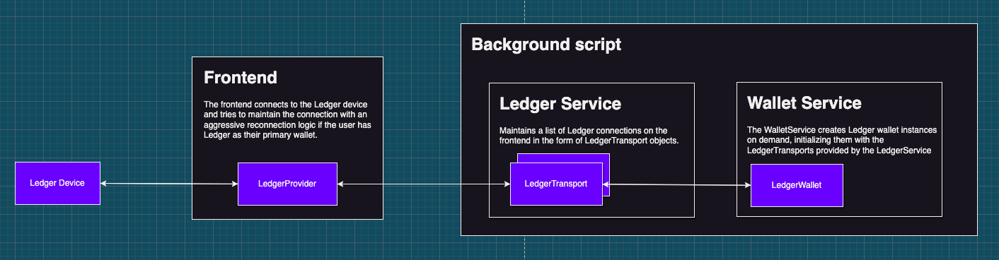
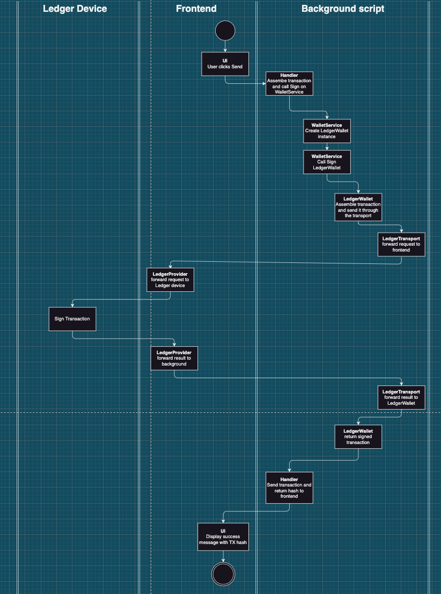

# Ledger

## Overview

Core provides Ledger support since the very early versions. Core supports both BIP44 (`m/44'/60'/0'/0/n`) and LedgerLive (`m/44'/60'/n'/0/0`) derivation paths via the same UX with the exception of account creation, where LedgerLive users need to connect their device for adding new accounts contrary to BIP44. This is due to the fact that it's not possible to request the extended public key of the `m/44'/60'` path on Ledger.

## Connection to the device

Due to some Manifest V3 restrictions, namely the lack of WebUSB access on the background script, there is a special `LedgerTransport` object on the background script. It implements Ledger's Transport interface and makes relaying the requests to the Ledger device possible through the frontend.

To avoid some unnecessary `frontend -> background -> frontend -> ledger -> frontend -> background` loops, we decided to expose a very limited set of Ledger interactions directly on the LedgerProvider on the frontend. These are meant for collecting all the public key and account information needed for Ledger onboarding.

### Limitations

Since the Ledger devices can only handle one WebUSB connection at a time, we always have to make sure, we have 1 and only 1 connection active to the device. Otherwise, sign requests can be unreliable. For example, an "old" window can be closed by the user unknowing that it was the one actually communicating with the device. 
To get ahead of this issue, the browser extension closes all non-active windows, making sure it only has one open at a time.

## Signing flow

The diagram below shows the generic data flow of signing a transaction. The generic idea is the same for all types of transactions, the only difference is the UI and the handler.

## Most common issues

- Ledger Live app is open. When Ledger Live is open it can grab the connection for the device, making the browser unable to connect.
- Using the wrong app. Core requires the Avalanche app for all EVM, X, and P chain interactions and the Bitcoin app for Bitcoin interactions.
- Signing typed data is not yet supported on the Avalanche app.

## DOs and DON'Ts

- **DO NOT** sign transactions on Ledger directly on the frontend. All signing should go through the WalletService on the background script.
- **DO** assume the Ledger device can be disconnected and reconnected at any time.
