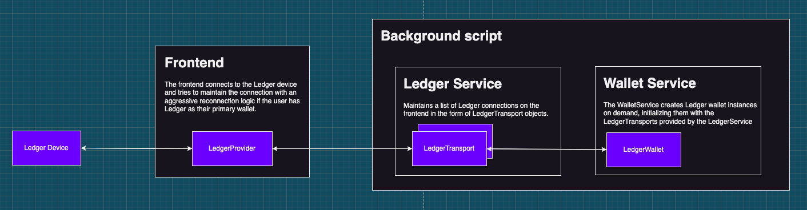
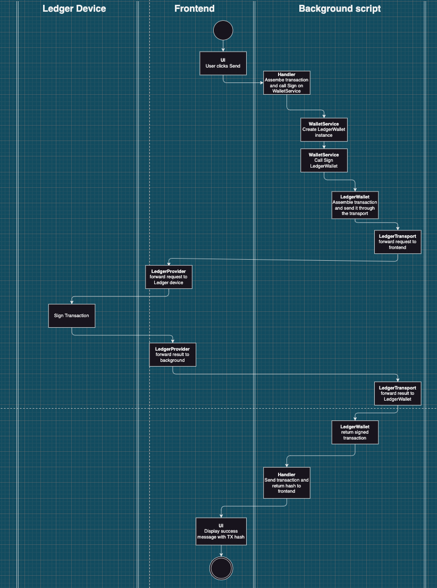

# Ledger

## Overview

Core provides Ledger support since the very early versions. Core supports both BIP44 (`m/44'/60'/0'/0/n`) and LedgerLive (`m/44'/60'/n'/0/0`) derivation paths via the same UX with the exception of account creation, where LedgerLive users need to connect their device for adding new accounts contrary to BIP44. This is due to the fact that it's not possible to request the extended public key of the `m/44'/60'` path on Ledger.

## Connection to the device

Due to some Manifest V3 restrictions, namely the lack of WebUSB access on the service worker, there is a special `LedgerTransport` object (`packages/service-worker/src/services/ledger/LedgerTransport.ts`) on the service worker. It implements Ledger's Transport interface and makes relaying the requests to the Ledger device possible through the frontend.

To avoid some unnecessary `frontend -> service worker -> frontend -> ledger -> frontend -> service worker` loops, we decided to expose a very limited set of Ledger interactions directly on the LedgerProvider on the frontend. These are meant for collecting all the public key and account information needed for Ledger onboarding.

### Limitations

Since the Ledger devices can only handle one WebUSB connection at a time, we always have to make sure, we have 1 and only 1 connection active to the device. Otherwise, sign requests can be unreliable. For example, an "old" window can be closed by the user unknowing that it was the one actually communicating with the device. 
To get ahead of this issue, the browser extension closes all non-active windows, making sure it only has one open at a time.

## Bitcoin: why Core asks for the `Bitcoin Recovery` app

Core keeps a Ledger wallet's Bitcoin addresses on the same account as its EVM addresses, so the wallet policy it registers on the device is derived from an Ethereum coin type: `44'/60'/0'` for BIP44 wallets and `44'/60'/n'` for LedgerLive ones (see [`useRegisterBtcWalletPolicy`](../packages/ui/src/hooks/useRegisterBtcWalletPolicy.ts)). No Bitcoin BIP describes that path, which makes it a non-standard one from the Bitcoin app's point of view.

Ledger's `Bitcoin` app stopped accepting non-standard derivation paths in version `2.4.3`, which locks Core out of it. `MAX_BITCOIN_APP_VERSION` in [`LedgerProvider`](../packages/ui/src/contexts/LedgerProvider/LedgerProvider.tsx) therefore pins the last usable version at `2.4.2`; on anything newer the approval overlay renders the `unsupported-btc-version` state and links users to the [support article](https://support.core.app/en/articles/13145665-why-doesn-t-my-bitcoin-ledger-application-work-with-core) instead of prompting for a signature.

The way around it is Ledger's `Bitcoin Recovery` app, which is still shipped without the path restriction. So `getRequiredApp()` in [`useLedgerApprovalState`](../apps/next/src/pages/Approve/components/hardware/ledger/useLedgerApprovalState.ts) asks for `Bitcoin Recovery` on Bitcoin networks, while `isCompatibleApp()` keeps accepting a plain `Bitcoin` app as long as it is on `2.4.2` or below — users who have not updated do not need to install anything new.

### Wallet policy registration

Signing a Bitcoin transaction needs a registered wallet policy (`wpkh(@0/**)`) on the device. Core decides whether to run the registration by asking the service worker for the stored master fingerprint via `WALLET_GET_BTC_WALLET_POLICY_DETAILS` — no fingerprint means the policy has not been registered for that wallet yet. `LedgerPolicyRegistrationStateContext` then fetches the extended public key for the path above, calls `registerWallet` and the user confirms it on the device once per wallet. Until that is done, the approval overlay sits in the `btc-policy-needed` state.

Registration only runs on a compatible Bitcoin app, so a user on `Bitcoin` 2.4.3+ sees the unsupported-version screen rather than a policy prompt.

## Signing flow

The diagram below shows the generic data flow of signing a transaction. The generic idea is the same for all types of transactions, the only difference is the UI and the handler.

## Most common issues

- Ledger Live app is open. When Ledger Live is open it can grab the connection for the device, making the browser unable to connect.
- Using the wrong app. `getRequiredApp()` asks for the Ethereum app on Ethereum mainnet and its testnets, the Solana app on Solana, `Bitcoin Recovery` on Bitcoin, and the Avalanche app everywhere else — including EVM chains other than Ethereum.
- Signing typed data is not yet supported on the Avalanche app.

## DOs and DON'Ts

- **DO NOT** sign transactions on Ledger directly on the frontend. All signing should go through the `WalletService` on the service worker.
- **DO** assume the Ledger device can be disconnected and reconnected at any time.
