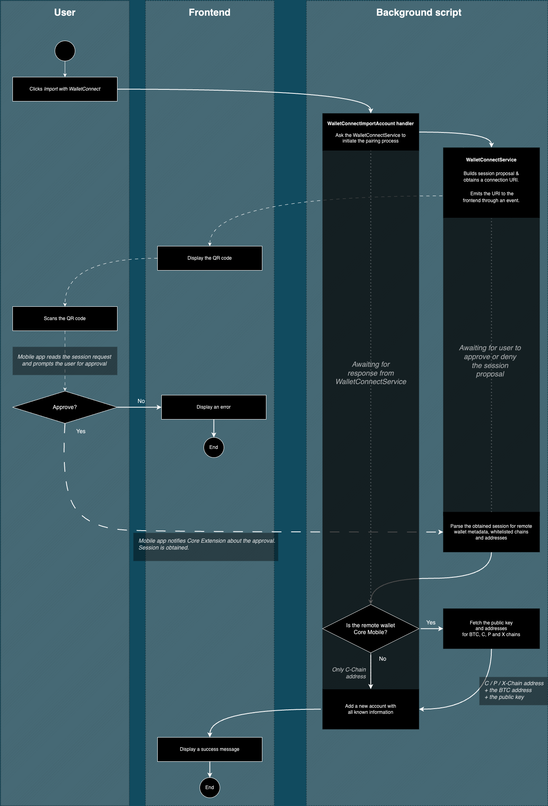
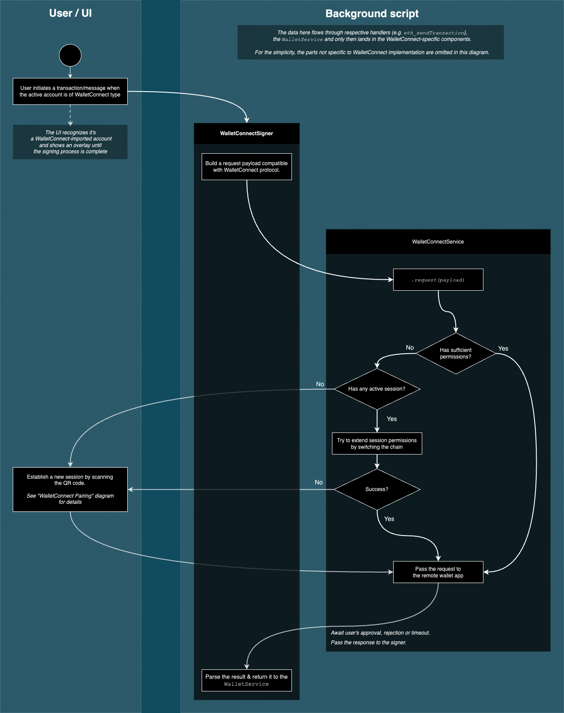

# WalletConnect

## Overview

The Core browser extension provides support for importing external accounts into the Core wallet by pairing a remote wallet (most commonly a mobile app) using WalletConnect protocol.

## Pairing flow

The diagram below shows a simplified data flow of the WalletConnect pairing process.

1. Pairing process is initiated by Core extension, which generates a URI and displays a corresponding QR code for the user to scan with their. If the remote wallet is not equipped with a camera (e.g. it's a desktop app), the user can also copy the URI and paste it in the wallet app.
2. Upon scanning the QR code, the wallet app can obtain information about the Core extension and the access it requests (i.e. chains, accounts, events, methods). The wallet app should then present that information to the users and let them choose whether they want to continue or abort the pairing process.
   - Upon denial, an error message is shown.
     - Upon approval, Core extension fetches the obtained account address and adds it to the list of imported accounts.

## Signing flow

The diagram below shows a simplified data flow of the WalletConnect signing process.

1. Just like pairing, signing is also initiated by Core extension.
2. The request flows through handlers, to `WalletService` and then ends up in `WalletConnectSigner` and `WalletConnectService`.
3. We verify if we have an active session. If we do, we verify if that session has sufficient permissions.
   - If there is a `"No"` answer to any of these questions, we try to upgrade the session permissions or establish a new session.
4. We pass the signing request to the remote wallet app and await a response.
   - Depending on the request, we expect either a signature or a transaction hash in return.
5. When we receive a successful response, we parse it and pass it back to the `WalletService`.

## Limitations

### Avalanche P/X-Chain support

Most wallet apps only implement support for EVM. At the moment only known WalletConnect-compatible wallet that supports Avalanche X/P signing is **Core Mobile**.

### Bitcoin support

BTC signing is not supported at the moment, as none of the known wallets support it via WalletConnect.

### Multiple chains

Some apps (i.e. Metamask Mobile), do not accept multiple chains to be requested in a session proposal payload - they will automatically reject such a request.

Since we don't know which wallet app the user will use when we initiate the pairing, we must always specify only a single chain in the session proposal - and we default to the currently active chain.
Most of the time, new chains can added to the session at a later point and we do it on demand, when the user actually tries to sign a message or transaction on a different chain. For more information on that, please refer to a well-documented `establishRequiredSession` method of the [`WalletConnectService`](../src/background/services/walletConnect/WalletConnectService.ts).

## Data storage

By default, the WalletConnect SDK uses `localStorage` for storing session data. In the extension realm, though, it is not accessible.

Fortunately, the WalletConnect SDK allows us to pass a custom implementation of storage to accommodate those needs. Hence we introduced a [`WalletConnectStorage`](../src/background/services/walletConnect/WalletConnectStorage.ts) class that builds on top of our `StorageService`.

Also, since there is a lot of read & write operations and `chrome.storage` is a bit slow, we namespace all of the related data under one `chrome.storage` key. This allows us the WalletConnect SDK to iterate over saved data much quicker.

## Most common issues

- It's possible for the remote wallet app to disconnect the pairing without notifying Core about it. If that happens, our requests could be sent out, but they won't reach any device and will hang indefinitely. If this happens to you, try re-importing your account.
- There is no way for Core extension to know if the request sent to the mobile wallet was properly handled. A bug in the remote wallet app could cause the request to hang indefinitely (i.e. when the mobile app accepts the request, but does not respond at all).
- There is no way of knowing which methods the remote wallet will whitelist for Core to use. That's why we keep the requested methods list fairly modest. When a given method is not whitelisted, we only get a generic _NOPE_ error without any specific information about which of the requested methods caused the pairing request to be denied.
- If Core sends a signing request while the remote wallet is inactive (e.g. the mobile app is not open, the phone is locked), it may not be delivered successfully. We show a "Resend" button for that reason. Clicking it should send the same request again.

## DOs and DON'Ts

- **DO NOT** assume you have an active session or that the session has sufficient permissions.
- **DO NOT** assume the request reached the device. **DO** allow for the request to be re-sent.
- **DO NOT** assume the response is a signature. Depending on the request method (e.g. `avalanche_sendTransaction` vs `avalanche_signTransaction`), the transaction will either be dispatched by the remote wallet app and you'll receive the hash, or it won't be dispatched and you'll receive a signature.\
