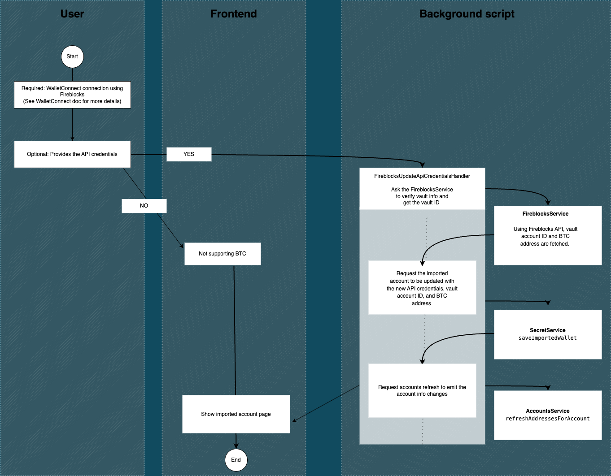
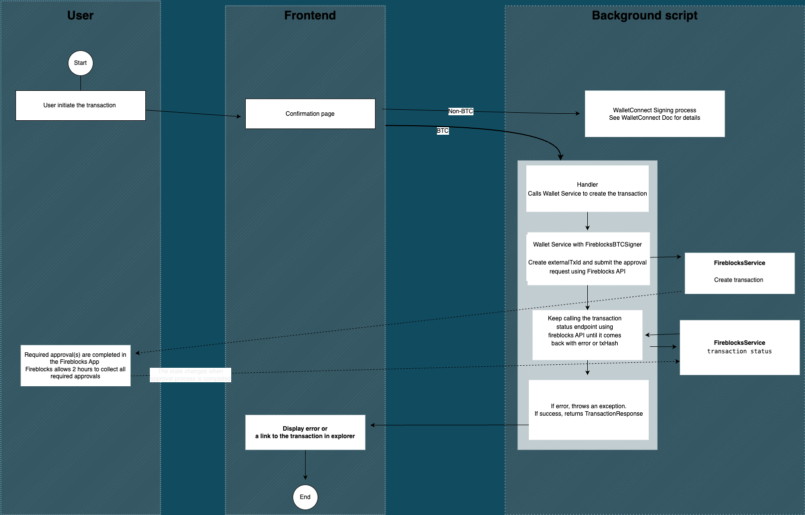

# Fireblocks

## Overview

By importing Fireblocks account, the users are able to interact with blockchains using Core Browser Extension.

## Elements of Fireblocks Wallet

Fireblocks wallet uses 2 separate flow depending on the network.

1. Bitcoin network uses Fireblocks API (The production build only supports mainnet.)
   (If API credentials are not provided, Bitcoin network is not supported.)
2. All other networks use WalletConnect connection to interact with Fireblocks
   (See WalletConnect doc for more details)

## Importing Process

Importing Fireblocks account has 2 steps.

1. Pairing using WalletConnect. (Required)
2. Providing Fireblocks API credentials (Optional)



### Pairing with WalletConnect

This is a required step and the user has to use Fireblocks app to pair with WalletConnect.
(See WalletConnect doc for more details)
If other apps besides fireblocks app are used to pair, we automatically switch the imported account to WalletConnect.

### Fireblocks API Credentials

This is an optional step. However opting out will cause Bitcoin networks to not be supported.

First the user must create the CSR file. Then create an API user in Fireblocks console using the CSR file.
(Please see https://developers.fireblocks.com/docs/quickstart for more details.)

Then the user can provide us with 2 info.

1. API key (This can be found in Fireblocks console under users tab in settings.)
2. API Secret (This is the content of .key file from creating a CSR file.)

We store these encrypted like other secrets like private keys.
The API credentials can't be added, edited, and delted separately right now.
So the user will have to delete the imported Fireblocks account and then re-import it if they would like to change the info.

## Signing Flow

For non-bitcoin signing flow, please see WalletConnect doc.

### Fireblocks Signing Flow

Fireblocks has Transaction Authorization Policy (TAP) which allows each organization to create the rules on how the approval process should happens.
Each policy will decide how many people out of the people listed in the policy needs to sign for the approval to be official. And they can have more than 1 policies to cover different cases based on assets, amount, destination, etc.

1. The user submit the request in Core Browser Extension. The user will see the pending state on the confirmation screen.
2. Core Browser Extension request fireblocks to process the request using API using an unique external transaction ID.
3. Fireblocks uses the TAP to get all required appovals. If any needed. Auto approval is also possible.
4. Core Browser Extension fetch the result based on an unique external transaction ID and wait until the returned state has an error or a txHash.
5. Core Browser Extension returns the txHash (If successful)/ error (If not successful) to UI
6. The UI closes the confirmation screen and show the toast with link to the transaction in explorer (If successful)/ the error (If not successful)



## Limitations

Bitcoin Testnet Support
Fireblocks testnet and mainnet workspaces have completely different addresses & configurations, so we can't really use the same connections & API keys to handle both.
Because of this, we have decided to only support mainnet in production.

## Transaction Troubleshooting

Below are some of the issues I encountered so far while creating transactions and solutions to those problems.

### **`Bad source id`**

Even though vault accounts have numerical IDs, make sure you're passing them as a string. For example:

#### ❌ Bad

```
{ id: 0, type: PeerType.VAULT_ACCOUNT }
```

#### ✅ Good

```
{ id: '0', type: PeerType.VAULT_ACCOUNT }
```

### **`Signer not found`**

#### **Error message**

> Fireblocks couldn’t find a signer for the transaction. This may happen when:
>
> - The signer doesn’t have permission to sign transactions.
> - The transaction authorization policy (TAP) rule has multiple designated signers, but none has signing privileges.

#### **Solution**

I was using an API User that has an `Editor` role assigned, but our policy did not state a designated signer for transactions like that.

To explain a bit better, transactions initiated by users with an `Editor` role have to be signed by a different user: an `Owner`, an `Admin` or a `Signer`, since those are the only roles that can actually sign shit.

So to make it work, I had to modify our transaction policy so that all transactions initiated by our `API User: Editor` have at least one designated signer assigned.

A different workaround here would be to not use the `API User: Editor`, but rather `API User: Signer`.
Since the transaction initiator is its designated signer by default, this setup just works.

## open questions

### Importing accounts

When user submits the API Key and the Secret Key, we’ll possibly get access to multiple vault accounts.

These accounts then have dedicated wallets for different assets. Each of these asset wallets then will have _at least_ one address. Some may have multiple addresses (i.e. BTC).

Also, newly created vault accounts will have no asset wallets added and therefore will have no addresses defined at all.

So there are multiple questions here:

- How do we choose which vault account to import?
- Should we allow importing multiple vault accounts?
- How do we ensure the selected vault account(s) have at least the EVM address defined?
- If an asset (i.e. BTC) has multiple addresses defined, how do we choose the proper one?
  - Here, we should probably choose the address denoted as `permanent`.
- _probably more will arise_

### Asset IDs

Fireblocks have their own "symbols" for each asset. For example:

- ETH Goerli is `ETH_TEST3`
- Avalanche Fuji is `AVAXTEST`.

For BTC this is not an issue, because there are only two symbols: `BTC` for mainnet and `BTC_TEST` for testnet.

If we use WalletConnect for EVM transactions, things are still simple - nothing to worry about here.

However, if we ever want to support EVM through Fireblocks API - things get complicated, as we have no way of knowing the Fireblocks asset IDs for network-native tokens.

There is a `/supported_assets` on the API, but it's only helpful for non-native tokens. For native assets, it does not show the contract address that we could use to match the tokens.

### Avalanche Bridge

Bridging `BTC` -> `BTC.b` _SimplyWorks™_, but the `BTC.b` token does not show up in the Fireblocks console automatically.

The token needs to be added manually by doing the following:

1. Go to a vault account
2. Click `+ Asset Wallet`
3. Type random characters in the search field until it shows an `Add a non-listed ERC20 asset` option
4. In the dialog:
   - **For Fuji:** specify `Avalanche Fuji` as the Blockchain Network and `0x0f2071079315Ba5a1c6d5b532a01a132c157AC83` as the contract address.
   - **For Mainnet:** specify `Avalanche` as the Blockchain Network and `0x152b9d0FdC40C096757F570A51E494bd4b943E50` as the contract address.

We should probably inform the users about that when they start bridging using Fireblocks account.

## Soon to Come

We are going to introduce 2 features in the future.

1. Pending fireblocks tx tracker
   We would like to let users to be able to use the extension while they wait when the approval process in Fireblocks is taking awile.
2. API credential editor
   We would like to let users add, update, and delete the API credential whenever they would like. Right not, they would have to delete then re-import the fireblocks account.
