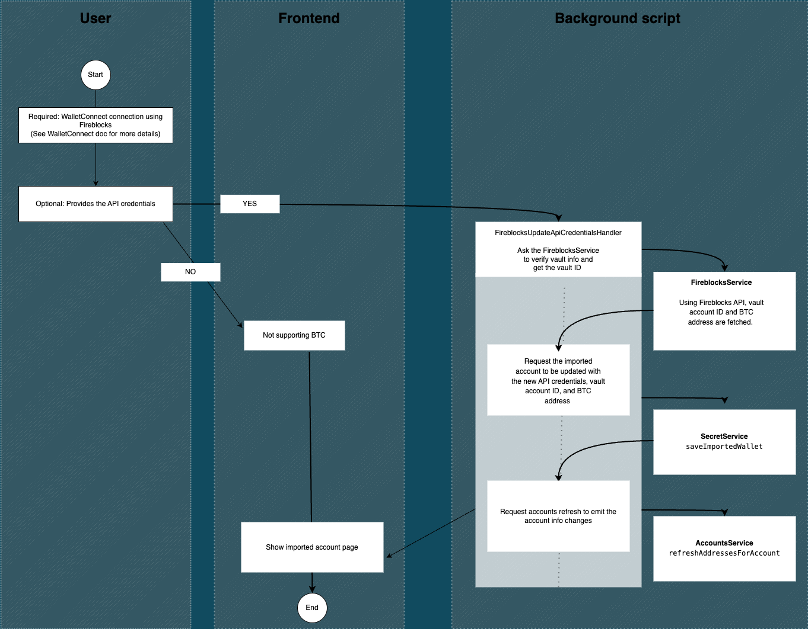
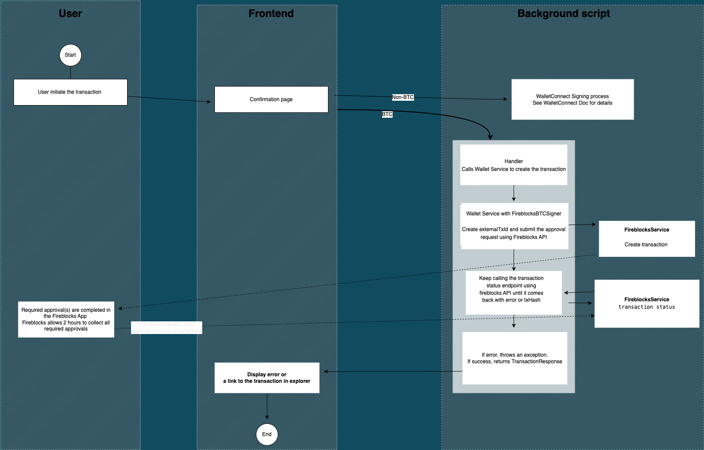

# Fireblocks

## Overview

By importing Fireblocks account, the users are able to interact with blockchains using Core Browser Extension.

## Elements of Fireblocks Wallet

Fireblocks wallet uses 2 separate flow depending on the network.

1. Bitcoin network uses Fireblocks API (The production build only supports mainnet.)
   (If API credentials are not provided, Bitcoin network is not supported.)
2. All other networks use WalletConnect connection to interact with Fireblocks
   (See WalletConnect doc for more details)

## Importing Process

Importing Fireblocks account has 2 steps.

1. Pairing using WalletConnect. (Required)
2. Providing Fireblocks API credentials (Optional)



### Pairing with WalletConnect

This is a required step and the user has to use Fireblocks app to pair with WalletConnect.
(See WalletConnect doc for more details)
If other apps besides fireblocks app are used to pair, we automatically switch the imported account to WalletConnect.

### Fireblocks API Credentials

This is an optional step. However opting out will cause Bitcoin networks to not be supported.

First the user must create the CSR file. Then create an API user in Fireblocks console using the CSR file.
(Please see https://developers.fireblocks.com/docs/quickstart for more details.)

Then the user can provide us with 2 info.

1. API key (This can be found in Fireblocks console under users tab in settings.)
2. API Secret (This is the content of .key file from creating a CSR file.)

We store these encrypted like other secrets like private keys.
The API credentials can't be added, edited, and deleted separately right now.
So the user will have to delete the imported Fireblocks account and then re-import it if they would like to change the info.

## Signing Flow

For non-bitcoin signing flow, please see WalletConnect doc.

### Fireblocks Signing Flow

Fireblocks has Transaction Authorization Policy (TAP) which allows each organization to create the rules on how the approval process should happens.
Each policy will decide how many people out of the people listed in the policy needs to sign for the approval to be official. And they can have more than 1 policies to cover different cases based on assets, amount, destination, etc.

1. The user submit the request in Core Browser Extension. The user will see the pending state on the confirmation screen.
2. Core Browser Extension request fireblocks to process the request using API using an unique external transaction ID.
3. Fireblocks uses the TAP to get all required approvals. If any needed. Auto approval is also possible.
4. Core Browser Extension fetch the result based on an unique external transaction ID and wait until the returned state has an error or a txHash.
5. Core Browser Extension returns the txHash (If successful)/ error (If not successful) to UI
6. The UI closes the confirmation screen and show the toast with link to the transaction in explorer (If successful)/ the error (If not successful)



## Limitations

### Bitcoin testnet

Fireblocks testnet and mainnet workspaces have completely different addresses & configurations, so we can't really use the same connections & API keys to handle both.
Because of this, we have decided to only support mainnet in production.

### API credentials cannot be edited

API credentials can't be added, edited, or deleted separately. Changing them requires deleting the imported Fireblocks account and re-importing it.

## Transaction troubleshooting

### `Bad source id`

Even though vault accounts have numerical IDs, they must be passed as a string:

```js
// Bad
{ id: 0, type: PeerType.VAULT_ACCOUNT }

// Good
{ id: '0', type: PeerType.VAULT_ACCOUNT }
```

### `Signer not found`

> Fireblocks couldn't find a signer for the transaction. This may happen when:
>
> - The signer doesn't have permission to sign transactions.
> - The transaction authorization policy (TAP) rule has multiple designated signers, but none has signing privileges.

Transactions initiated by a user with the `Editor` role have to be signed by a different user — only `Owner`, `Admin`, and `Signer` roles can sign. If the workspace policy does not name a designated signer for `Editor`-initiated transactions, Fireblocks has nobody to route the approval to.

Two ways to resolve it:

- Modify the transaction policy so that transactions initiated by the API user have at least one designated signer assigned, or
- Use an `API User: Signer` instead of an `API User: Editor`. The transaction initiator is its own designated signer by default, so no policy change is needed.

## Asset IDs

Fireblocks uses its own symbols for each asset — Avalanche Fuji is `AVAXTEST`, for example. Bitcoin only has two: `BTC` for mainnet and `BTC_TEST` for testnet, which is all the current integration needs.

This becomes a problem only if EVM support ever moves from WalletConnect to the Fireblocks API. The `/supported_assets` endpoint does not expose contract addresses for network-native tokens, so there is no reliable way to map them.

## Bridging BTC to BTC.b

Bridging works, but the resulting `BTC.b` token does not show up in the Fireblocks console automatically. It has to be added manually:

1. Go to a vault account
2. Click `+ Asset Wallet`
3. Type random characters in the search field until it shows an `Add a non-listed ERC20 asset` option
4. In the dialog, specify the blockchain network and contract address:
   - **Fuji:** `Avalanche Fuji` / `0x0f2071079315Ba5a1c6d5b532a01a132c157AC83`
   - **Mainnet:** `Avalanche` / `0x152b9d0FdC40C096757F570A51E494bd4b943E50`
