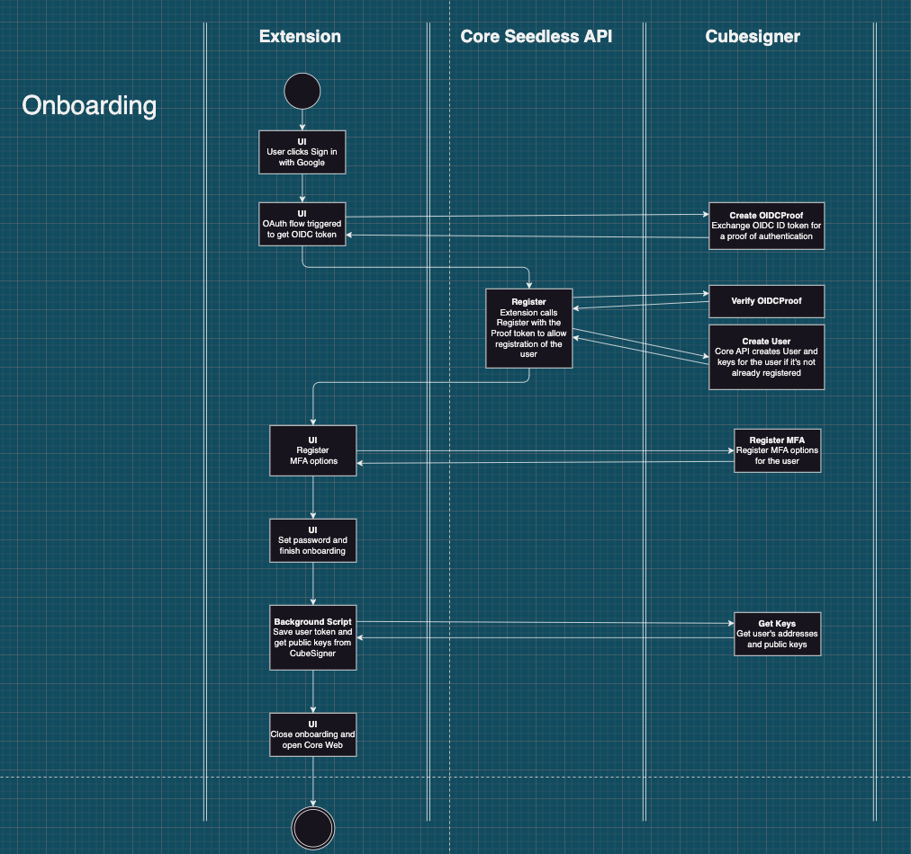
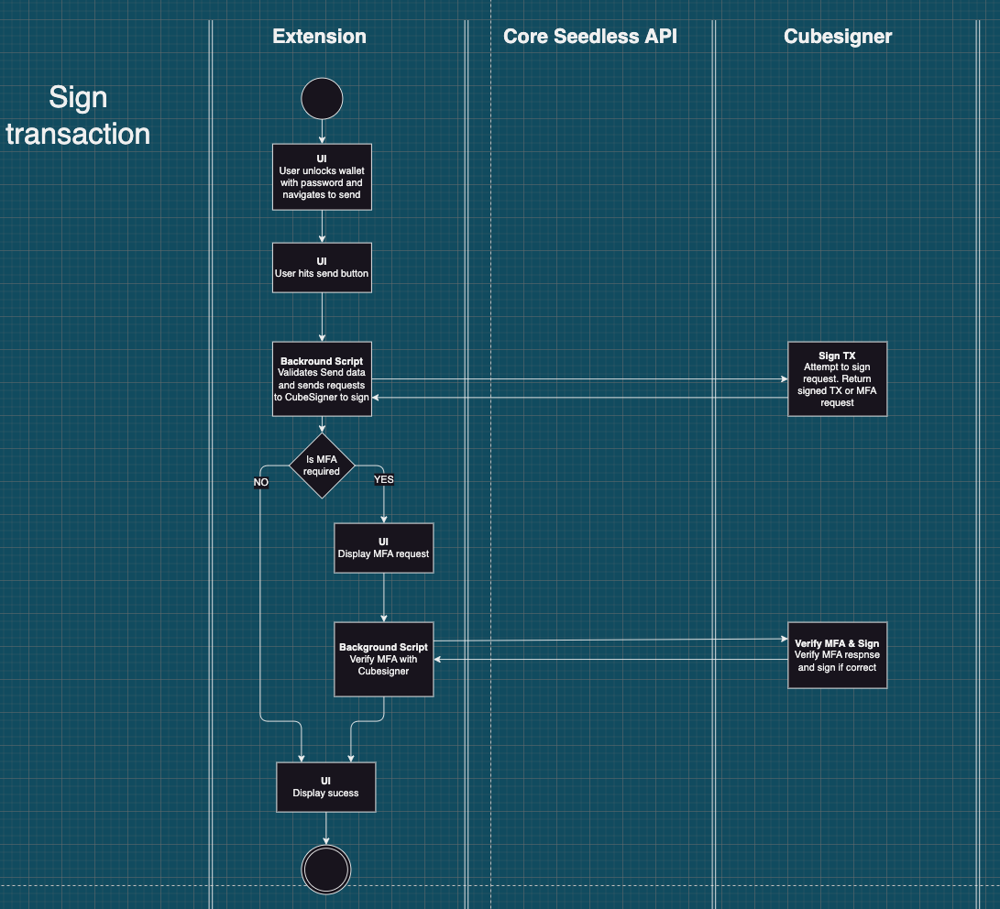

# Seedless wallets

## Overview

Core integrates CubeSigner to provide Seedless onboarding and sign in functionality. This allows users to sign into Core using their supported OIDC provider such as Google and a chosen MFA device.

## Resources

- CubeSigner documentation: https://signer-docs.cubist.dev/
- Typescript SDK: https://github.com/cubist-labs/CubeSigner-TypeScript-SDK
- CubeSigner CLI: https://github.com/cubist-partners/CubeSigner
- Seedless API Repository: https://github.com/ava-labs/core-seedless-api

## Seedless Runbook

Runbook documenting production access, and incident handling procedures: https://ava-labs.atlassian.net/wiki/spaces/EN/pages/2471231641/Seedless+Runbook

## Key management

Tokens are managed through the Typescript SDK and through the CLI. Both of them do the token refresh process on their own, automatically. To keep the refreshed token up-to-date in the storage, we need to implement our own storage interface and feed it to the SDK.
During the implementation you will meet 4 types of tokens:

### OIDC token

OIDC tokens are JWT tokens aquired from the integrated authentication providers like Google. They are used for registration and authentication of the user. Users usually have to be prompted via authentication popups so that they can select the account they want to use. During the onboarding flow they are exchanged for Signer and Management tokens.

### Signer session token

Provided by CubeSigner to be used for signing transactions and messages.
They can be aquired either via exchanging the OIDC token and using the configured MFA devices or via regular login flow for non OIDC users.

Signer session tokens expire either if the session lifetime expires (maximalized in 1y) or if a refresh token expires before a new one is generated.

The two most important tokens in the signer session token are:

- `id_token`: has a very limited lifetime (5 min), used for authentication to CubeSigner
- `refresh_token`: used for refreshing the `id_token`. When refreshing the `id_token`, the `refresh_token` is also updated. It has a longer (90 day) lifetime. If this token expires, for example Core was not used in the past 90 days, the user has to re-authenticate using OIDC.

### Managment token

Provided by CubeSigner to be used for management purposes. Depending on the role of the user they can be VERY powerful. For regular users it's used to manage their MFA settings and their own policies.
The owner and non OIDC accounts' management token is way more powerful. The owner account can set policies for the entire organization, create new users, keys, move keys between users, deleting OIDC users, etc. Pretty much can do anything CubeSigner provides. Regular users are a bit less strong, they still can be used for creating new users and new keys, but they are not able to delete users or set org-wide policies.

They can be aquired either via exchanging the OIDC token and using the configured MFA devices or via regular login flow for non OIDC users.

### Limited scoped management token

Used on the backend API. Since the owner's management token is way too powerful for an API deployment, we are utilizing a scoped token, which can only do what it absolutely must have to.
Scopes can be configured, e.g: only allow new user and key creation, but don't allow key re-assignment

## Onboarding flow

The onboarding flow requires communication with both the Core seedless backend and with CubeSigner.

1. Extension acquires OIDC from Authentication provider
2. Extension get a Proof of authentication from CubeSigner. This step is required to avoid sending OIDC tokens to our backend directly.
3. Core Backend verifies the Proof. After verification, it creates the users and the keys for the first account if the user does not exists yet.
4. For new users, extension exchanges the OIDC token for a signer session token and prompts the user to configure MFA options.
5. For existing users, the extension prompts the user to use the previously configured MFA device and exchanges the OIDC token for a signer session token.
6. Using the session token, extension configures the account list and initializes the seedless wallet.

### OIDC providers

CubeSigner supports multiple authentication providers like Google, Apple, Facebook and Twitter.
During registration the issuer of the token (`iss`) and the subject (`sub`) are extracted from the JWT and used for registering the user. This means using different issuers from the same provider does result in 2 separate accounts on CubeSigner.

**NOTE:** Google uses two separate issuers for tokens `https://accounts.google.com` and `accounts.google.com`. Extension uses the `accounts.google.com`!!

**NOTE:** Accounts are not matched by email on CubeSigner. Signing up with Google and Apple ID, even if the emails are the same will result in two separate accounts!

## Add new account

CubeSigner can generate keys in 2 ways. It's possible to generate standalone keys which or generate a long lived mnemonic and derive keys from them. While using standalone keys is more secure, since if one is compromised the rest are still safe, it has some drawbacks. To fit the account model of Core and to make key export an easier we opted for using the more familiar single mnemonic approach.

Adding new accounts AKA generating new keys for a user, requires management session. Therefore we do that via our API.

1. User clicks add account button in Core
2. Core creates a Proof of authentication via CubeSigner
3. Sends the Proof and the requested account index to the Core backend API
4. Core API verifies proof with CubeSigner and generates new keys if they don't already exist
5. Extension fetches all keys from CubeSigner and adds the new keys

## Signing

Signing always happens on the CubeSigner backend which are HSM-sealed Nitro enclaves in AWS. For signing, the extension needs and active signer session token.

There are two ways to sign transactions:

### Typed signing

CubeSigner provides various typed endpoints for signing transactions and messages. Use these whenever you can!!
Signing with the typed endpoints is always preferred since CubeSigner's policy engine can apply and run policies on the typed transactions whereas it's unable to do so on raw blob signing.

### Raw blob signing

It can be used for signing an arbitrary blob with a given key. We use this when a network specific, typed endpoint does not exists.
Using raw blob signing requires adding the `AllowRawBlobSigning` policy to the used key.

### Signing flow

## Deleting accounts

Deleting OIDC accounts is possible via an owner's management session. Deleting accounts removes the user's access from the session, but does not delete their keys.
**NOTE:** Deleting and re-registering does not re-assing the old keys to the user. A new registration will result in having new keys and addresses.

## DOs and DON'Ts

- DO use typed endpoints for signing transactions whenever you can
- DO always use and verify proofs when interacting with Core APIs
- DON'T delete your OIDC account if it has a lot of assets. Recovery is possible in gamma but not in production.
